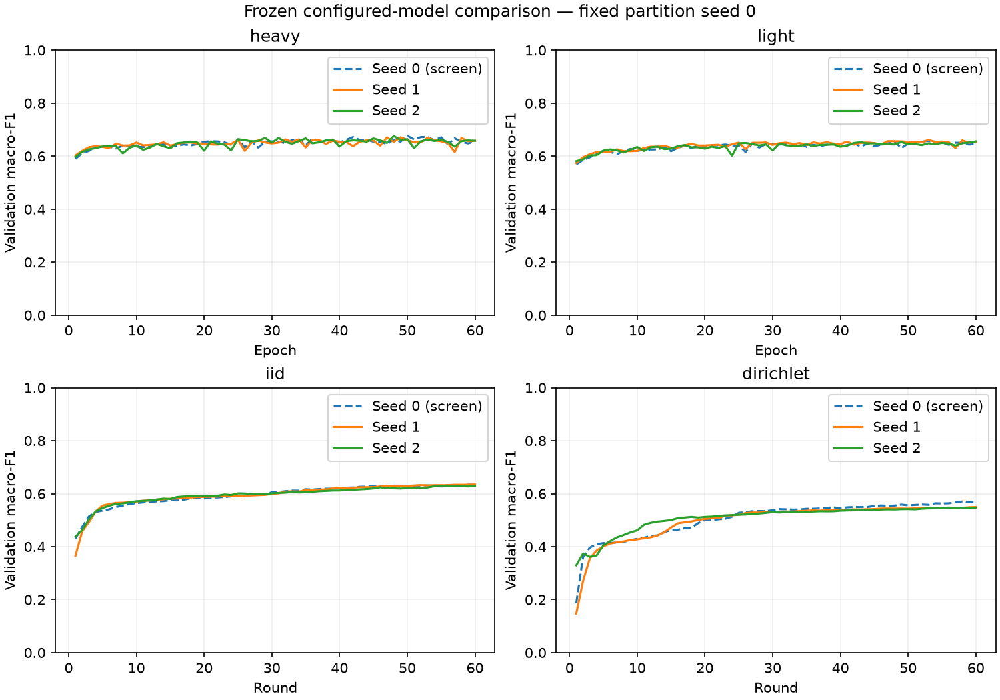

# Configured-model training-seed stability — 2026-10-05

Validation only. Eight new runs (seeds 1/2) plus four reused screening runs (seed 0). All use 60 steps and partition seed 0. No cross-seed winner is selected.

| Model | Seed 0 (screen) | Seed 1 | Seed 2 | All-seed F1 mean ± sample SD | New-seed F1 mean ± sample SD |
|---|---:|---:|---:|---:|---:|
| heavy | 0.6769 | 0.6711 | 0.6759 | 0.6747 ± 0.0031 | 0.6735 ± 0.0034 |
| light | 0.6576 | 0.6615 | 0.6559 | 0.6583 ± 0.0029 | 0.6587 ± 0.0040 |
| iid | 0.6339 | 0.6345 | 0.6300 | 0.6328 ± 0.0024 | 0.6322 ± 0.0031 |
| dirichlet | 0.5705 | 0.5495 | 0.5472 | 0.5557 ± 0.0128 | 0.5483 ± 0.0016 |

## Every run: selected step and benign false alerts

| Model | Seed | Selected step | False alerts |
|---|---:|---:|---:|
| heavy | 0 | 50 | 20.35% |
| heavy | 1 | 49 | 23.98% |
| heavy | 2 | 48 | 21.59% |
| light | 0 | 53 | 22.66% |
| light | 1 | 53 | 23.57% |
| light | 2 | 60 | 24.48% |
| iid | 0 | 59 | 23.88% |
| iid | 1 | 60 | 25.72% |
| iid | 2 | 58 | 23.08% |
| dirichlet | 0 | 58 | 4.78% |
| dirichlet | 1 | 60 | 4.40% |
| dirichlet | 2 | 59 | 3.71% |

## All seeds 0/1/2: class recall and false alerts (mean ± sample SD)

| Metric | Heavy | Light | IID | Non-IID |
|---|---:|---:|---:|---:|
| benign_false_alert_rate | 21.97% ± 1.85 pp | 23.57% ± 0.91 pp | 24.23% ± 1.36 pp | 4.30% ± 0.54 pp |
| Benign | 78.03% ± 1.85 pp | 76.43% ± 0.91 pp | 75.77% ± 1.36 pp | 95.70% ± 0.54 pp |
| DDoS | 79.63% ± 1.09 pp | 79.19% ± 1.64 pp | 80.00% ± 0.29 pp | 98.65% ± 1.27 pp |
| DoS | 82.57% ± 1.49 pp | 79.23% ± 2.46 pp | 76.08% ± 0.22 pp | 17.34% ± 4.51 pp |
| Recon | 74.97% ± 2.24 pp | 76.56% ± 3.65 pp | 77.35% ± 1.27 pp | 52.08% ± 1.44 pp |
| Web-based | 31.05% ± 10.32 pp | 29.78% ± 1.99 pp | 12.79% ± 5.27 pp | 1.43% ± 2.48 pp |
| Brute Force | 25.51% ± 0.75 pp | 16.49% ± 0.21 pp | 14.80% ± 0.00 pp | 14.80% ± 0.00 pp |
| Spoofing | 81.25% ± 2.77 pp | 77.36% ± 3.08 pp | 70.41% ± 1.35 pp | 48.48% ± 1.21 pp |
| Mirai | 99.50% ± 0.04 pp | 99.44% ± 0.01 pp | 99.25% ± 0.02 pp | 99.18% ± 0.02 pp |

## New seeds 1/2 only: class recall and false alerts (mean ± sample SD)

| Metric | Heavy | Light | IID | Non-IID |
|---|---:|---:|---:|---:|
| benign_false_alert_rate | 22.78% ± 1.69 pp | 24.02% ± 0.65 pp | 24.40% ± 1.87 pp | 4.06% ± 0.49 pp |
| Benign | 77.22% ± 1.69 pp | 75.98% ± 0.65 pp | 75.60% ± 1.87 pp | 95.94% ± 0.49 pp |
| DDoS | 79.26% ± 1.25 pp | 78.49% ± 1.59 pp | 79.86% ± 0.23 pp | 99.38% ± 0.23 pp |
| DoS | 83.15% ± 1.57 pp | 80.27% ± 2.38 pp | 76.19% ± 0.16 pp | 14.75% ± 0.73 pp |
| Recon | 75.32% ± 3.05 pp | 76.22% ± 5.10 pp | 76.62% ± 0.26 pp | 51.26% ± 0.31 pp |
| Web-based | 29.86% ± 14.30 pp | 29.46% ± 2.70 pp | 13.06% ± 7.43 pp | 0.00% ± 0.00 pp |
| Brute Force | 25.63% ± 1.02 pp | 16.43% ± 0.26 pp | 14.80% ± 0.00 pp | 14.80% ± 0.00 pp |
| Spoofing | 81.40% ± 3.90 pp | 78.13% ± 3.93 pp | 71.18% ± 0.36 pp | 48.19% ± 1.56 pp |
| Mirai | 99.48% ± 0.03 pp | 99.44% ± 0.00 pp | 99.26% ± 0.02 pp | 99.17% ± 0.01 pp |

## Every seed: per-class recall

| Model / seed | Benign | DDoS | DoS | Recon | Web-based | Brute Force | Spoofing | Mirai |
|---|---:|---:|---:|---:|---:|---:|---:|---:|
| heavy / 0 | 79.65% | 80.37% | 81.43% | 74.26% | 33.44% | 25.27% | 80.94% | 99.54% |
| heavy / 1 | 76.02% | 80.14% | 82.04% | 77.48% | 39.97% | 26.35% | 78.64% | 99.50% |
| heavy / 2 | 78.41% | 78.37% | 84.26% | 73.16% | 19.75% | 24.91% | 84.16% | 99.46% |
| light / 0 | 77.34% | 80.57% | 77.16% | 77.23% | 30.41% | 16.61% | 75.83% | 99.43% |
| light / 1 | 76.43% | 79.62% | 78.59% | 72.61% | 31.37% | 16.61% | 80.91% | 99.44% |
| light / 2 | 75.52% | 77.37% | 81.95% | 79.83% | 27.55% | 16.25% | 75.34% | 99.44% |
| iid / 0 | 76.12% | 80.28% | 75.86% | 78.80% | 12.26% | 14.80% | 68.87% | 99.24% |
| iid / 1 | 74.28% | 79.69% | 76.30% | 76.44% | 18.31% | 14.80% | 71.43% | 99.28% |
| iid / 2 | 76.92% | 80.02% | 76.07% | 76.81% | 7.80% | 14.80% | 70.92% | 99.25% |
| dirichlet / 0 | 95.22% | 97.20% | 22.51% | 53.71% | 4.30% | 14.80% | 49.06% | 99.21% |
| dirichlet / 1 | 95.60% | 99.22% | 15.27% | 51.03% | 0.00% | 14.80% | 49.29% | 99.16% |
| dirichlet / 2 | 96.29% | 99.55% | 14.24% | 51.48% | 0.00% | 14.80% | 47.08% | 99.18% |

## Interpretation limits

- Seed 0 influenced screening and is not independent confirmation.
- All seeds reuse the same validation set; these are training-seed stability checks, not independent data confirmation.
- Fixed partition seed measures no variability across client partitions.
- Normalization differs between central-light and federated-light; dropout differs between heavy and light.
- No deployment or physical edge claim; no cloud resources.
- Sample SD is not a confidence interval; two new seeds cannot establish broad robustness.
- Both seeds retain validation-based checkpoint selection. No new independent data were evaluated.
- Normalization/dropout differ across configured models; these are not isolated federation/capacity effects.
- Host timing includes training/validation, excludes setup/checkpoint IO. New jobs ran in pairs under uncontrolled host load; no causal speed or edge-hardware comparison is supported.

All completion, configuration, source/data/package, selected-checkpoint, scaler and fixed-partition checks passed. Full per-class precision/recall/F1, confusion matrices and manifests: [summary.json](summary.json).

