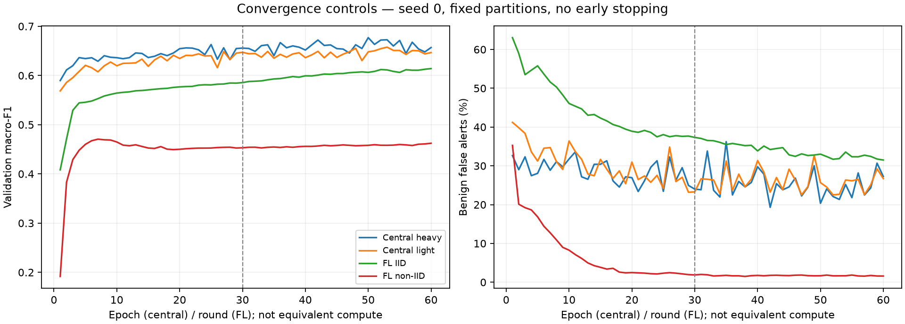

# Convergence controls — 60 epochs/rounds

Validation only; four configurations, model seed 0 and partition seed 0. No test evaluation or cloud resources.

Training source commit: `46239d5cb300573260c5144d69e03b340dbf7027`. All four runs share source, data and package hashes.

| Lane | Old patience-5 selected / stopped | Old macro-F1 | Best ≤30 (step) | Best ≤60 (step) | Gain 30→60 (pp) | Gate A / B |
|---|---:|---:|---:|---:|---:|---|
| Central heavy | 13 / 18 | 0.6458 | 0.6629 (25) | 0.6769 (50) | +1.40 | False / False |
| Central light | 27 / 30 | 0.6486 | 0.6486 (27) | 0.6576 (53) | +0.90 | False / False |
| FL IID | 30 / 30 | 0.5856 | 0.5856 (30) | 0.6140 (60) | +2.85 | True / True |
| FL non-IID | 7 / 12 | 0.4706 | 0.4706 (7) | 0.4706 (7) | +0.00 | False / False |

Gates are the predeclared project preferences, not significance or deployment tests. A requires +1 pp macro-F1 with at most +2 pp false alerts and at most 2 pp loss in any class recall. B requires −5 pp false alerts with at most 1 pp macro-F1 loss and at most 2 pp Web/Brute Force recall loss.

## Validation metrics at selected checkpoints

| Lane | Budget | Benign false alerts | Web recall | Brute Force recall | DoS recall |
|---|---:|---:|---:|---:|---:|
| Central heavy | 30 | 23.43% | 38.85% | 28.52% | 79.49% |
| Central heavy | 60 | 20.35% | 33.44% | 25.27% | 81.43% |
| Central light | 30 | 25.94% | 27.71% | 16.61% | 80.08% |
| Central light | 60 | 22.66% | 30.41% | 16.61% | 77.16% |
| FL IID | 30 | 37.33% | 1.75% | 14.80% | 82.63% |
| FL IID | 60 | 31.50% | 11.62% | 14.80% | 83.06% |
| FL non-IID | 30 | 12.74% | 0.00% | 14.80% | 0.13% |
| FL non-IID | 60 | 12.74% | 0.00% | 14.80% | 0.13% |

## Per-class recall at the best-through-60 checkpoint

| Class | Heavy | Light | FL IID | FL non-IID |
|---|---:|---:|---:|---:|
| Benign | 79.65% | 77.34% | 68.50% | 87.26% |
| DDoS | 80.37% | 80.57% | 71.14% | 99.93% |
| DoS | 81.43% | 77.16% | 83.06% | 0.13% |
| Recon | 74.26% | 77.23% | 80.35% | 34.83% |
| Web-based | 33.44% | 30.41% | 11.62% | 0.00% |
| Brute Force | 25.27% | 16.61% | 14.80% | 14.80% |
| Spoofing | 80.94% | 75.83% | 69.34% | 39.24% |
| Mirai | 99.54% | 99.43% | 99.34% | 98.18% |

Full per-class precision/recall/F1 and confusion matrices are in [summary.json](summary.json).

## Measured local compute

| Lane | Training + validation seconds | Training examples processed | Optimizer updates | Process peak RSS (MiB) |
|---|---:|---:|---:|---:|
| Central heavy | 417.3 | 26,435,640 | 51,660 | 1103.2 |
| Central light | 198.8 | 26,435,640 | 51,660 | 1036.8 |
| FL IID | 259.4 | 26,435,640 | 52,800 | 1080.5 |
| FL non-IID | 216.9 | 26,435,640 | 52,200 | 1098.9 |

RSS includes data and libraries; it is not inference memory. Time excludes data setup/checkpoint IO. FL update totals span separate client trajectories.



## Interpretation limits

- Single seed, exploratory validation checkpoint search; not a significance test.
- Best-of-60 has more validation selection opportunities than best-of-30.
- Equal examples do not imply equal optimizer steps, compute or trajectories.
- CPU host timing includes training/validation, not setup/checkpoint IO or physical edge measurements.

Full checkpoints and histories remain under `outputs/mlp-tuning/convergence` (Git-ignored). Original baseline reports are unchanged.

## Findings and next stage

- **Only FL IID passes the predeclared promotion gates** against its best-through-30 checkpoint. Its best score occurs at round 60, so this run does not establish convergence. Its Web recall remains only 11.62%, despite the improvement.
- Heavy gains 1.40 percentage points of macro-F1, but Web and Brute Force recall fall by 5.41 and 3.25 points. Improved precision can raise F1 while recall falls; the gain is not a uniform security benefit.
- Light gains 0.90 points of macro-F1, but DoS and Spoofing recall fall by 2.92 and 3.04 points. It also fails the promotion gates.
- Non-IID still selects round 7. At that checkpoint, Web recall is zero and DoS recall is 0.13%. Its low false-alert rate must not be mistaken for a useful detector. Longer training alone did not solve this failure; this experiment does not identify its cause.
- The next predeclared stage is **unweighted cross-entropy versus the current square-root-weighted loss**, using the same 60-step budgets in all four lanes. The current runs provide the weighted controls. Then test LayerNorm in the three light-model lanes as planned; do not assume BatchNorm is responsible before testing it.
- Four of twelve screening runs are complete; eight remain, with no confirmation runs yet. Confirm selected configurations across three model seeds before final explanatory claims. Do not enlarge the heavy model or spend RONIN credits based on these single-seed results alone.

The old patience-5 entries are retrospective replay of the first 30 steps, not additional training runs. Both budget comparisons select by validation macro-F1, not by false-alert rate. Gates above compare best-through-60 with best-through-30.

## Reproduction and verification

Run the four convergence commands from `configs/local_tuning_plan.json` using the research runner. To regenerate the numeric tables and plot from retained local outputs into a **new** directory:

```sh
.venv/bin/python reports/convergence_2026_10_03/analyze.py --output reports/convergence_regenerated
```

The analysis checks all 60 history steps, completion status, matching settings/source/data/packages, selected-checkpoint metrics and absence of test evaluation. All four saved `best.pt` SHA-256 hashes were separately verified against their result manifests. The interpretation section is manually authored and is not regenerated by the script. Training code and the frozen tuning plan were not changed for this stage.
