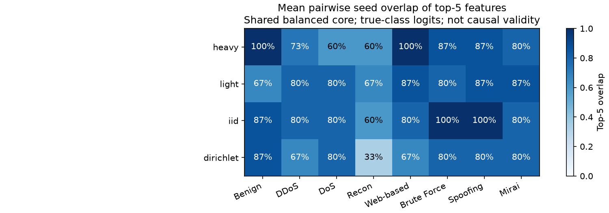

# SHAP numerical audit and failure evidence

Shared core: 64 validation rows; separate targeted supplement: 60 rows. Background: 128 training rows. Two expected-gradients repeats with 256 integration samples each. Attributions are in logit units.

## Approximation diagnostics

| Model / seed | Mean abs residual | p95 abs residual | Mean abs residual / mean abs output difference | Mean MC top-5 overlap across classes |
|---|---:|---:|---:|---:|
| heavy-seed-0 | 0.507 | 1.296 | 8.6% | 97.5% |
| heavy-seed-1 | 0.503 | 1.380 | 8.8% | 92.5% |
| heavy-seed-2 | 0.442 | 1.153 | 8.3% | 92.5% |
| light-seed-0 | 0.547 | 1.398 | 5.4% | 97.5% |
| light-seed-1 | 0.574 | 1.512 | 6.2% | 85.0% |
| light-seed-2 | 0.573 | 1.472 | 6.3% | 90.0% |
| iid-seed-0 | 0.445 | 1.126 | 7.2% | 92.5% |
| iid-seed-1 | 0.527 | 1.446 | 8.2% | 95.0% |
| iid-seed-2 | 0.489 | 1.151 | 8.5% | 95.0% |
| dirichlet-seed-0 | 0.314 | 0.831 | 7.7% | 90.0% |
| dirichlet-seed-1 | 0.348 | 0.893 | 7.9% | 95.0% |
| dirichlet-seed-2 | 0.341 | 0.897 | 7.6% | 90.0% |

Residuals measure deviation from logit difference to the sampled-background mean, not predictive error. Ratios are aggregate diagnostics, not per-case guarantees. Repeat overlap measures numerical sampling stability; it does not validate causal meaning.

## Core true-class-logit features and training-seed stability

| Model | True class | Leading features (normalized importance averaged across seeds) | Features in every seed top 5 | Mean pairwise top-5 overlap |
|---|---|---|---|---:|
| heavy | Benign | Weight, Number, rst_count, Header_Length, IAT | Weight, Number, rst_count, Header_Length, IAT | 100.0% |
| heavy | DDoS | Weight, Number, Max, psh_flag_number, Magnitue | Weight, Number, Max | 73.3% |
| heavy | DoS | Magnitue, Weight, Number, syn_count, rst_count | Magnitue, Weight, Number | 60.0% |
| heavy | Recon | Variance, Number, Weight, IAT, Magnitue | Variance, Number | 60.0% |
| heavy | Web-based | IAT, Number, Weight, Header_Length, rst_count | IAT, Number, Weight, Header_Length, rst_count | 100.0% |
| heavy | Brute Force | Number, Weight, IAT, syn_count, Variance | Number, Weight, IAT, syn_count | 86.7% |
| heavy | Spoofing | Number, Weight, Header_Length, IAT, Tot sum | Number, Weight, Header_Length, IAT | 86.7% |
| heavy | Mirai | Magnitue, Protocol Type, Header_Length, TCP, Weight | Magnitue, Protocol Type, Header_Length, TCP | 80.0% |
| light | Benign | Weight, rst_count, Max, Number, Header_Length | Weight, rst_count | 66.7% |
| light | DDoS | Max, Weight, Magnitue, IAT, Radius | Max, Weight, IAT | 80.0% |
| light | DoS | Weight, Magnitue, IAT, Variance, syn_flag_number | Weight, Magnitue, IAT, Variance | 80.0% |
| light | Recon | Weight, Variance, Number, IAT, Magnitue | Weight, Variance, IAT | 66.7% |
| light | Web-based | IAT, Weight, Number, Tot sum, Variance | IAT, Weight, Number, Variance | 86.7% |
| light | Brute Force | Weight, IAT, Number, Variance, Magnitue | Weight, IAT, Number, Variance | 80.0% |
| light | Spoofing | Header_Length, Weight, IAT, Number, rst_count | Header_Length, Weight, IAT, Number | 86.7% |
| light | Mirai | Magnitue, Protocol Type, Header_Length, AVG, Weight | Magnitue, Protocol Type, Header_Length, AVG | 86.7% |
| iid | Benign | Weight, Number, rst_count, IAT, Max | Weight, Number, rst_count, IAT | 86.7% |
| iid | DDoS | Weight, IAT, Protocol Type, Number, Max | Weight, IAT, Protocol Type, Number | 80.0% |
| iid | DoS | Weight, IAT, Number, Variance, ICMP | Weight, IAT, Number, Variance | 80.0% |
| iid | Recon | IAT, Weight, Variance, Number, HTTPS | IAT, Weight | 60.0% |
| iid | Web-based | Weight, IAT, Number, Tot sum, Variance | Weight, IAT, Number, Tot sum | 80.0% |
| iid | Brute Force | Weight, IAT, Number, Variance, flow_duration | Weight, IAT, Number, Variance, flow_duration | 100.0% |
| iid | Spoofing | Header_Length, Weight, IAT, Number, rst_count | Header_Length, Weight, IAT, Number, rst_count | 100.0% |
| iid | Mirai | Protocol Type, Min, Header_Length, Magnitue, syn_flag_number | Protocol Type, Min, Header_Length, Magnitue | 80.0% |
| dirichlet | Benign | rst_count, Weight, Number, IAT, Max | rst_count, Weight, Number, IAT | 86.7% |
| dirichlet | DDoS | IAT, Weight, Protocol Type, Number, Variance | IAT, Weight, Protocol Type | 66.7% |
| dirichlet | DoS | IAT, Weight, Number, Variance, Protocol Type | IAT, Weight, Number, Variance | 80.0% |
| dirichlet | Recon | Variance, IAT, fin_count, Number, Duration | None | 33.3% |
| dirichlet | Web-based | Weight, IAT, Number, Variance, Tot sum | Weight, IAT, Number | 66.7% |
| dirichlet | Brute Force | Weight, IAT, Number, Variance, ack_flag_number | Weight, IAT, Number, Variance | 80.0% |
| dirichlet | Spoofing | Header_Length, IAT, Weight, Number, Variance | Header_Length, IAT, Weight, Number | 80.0% |
| dirichlet | Mirai | Protocol Type, Header_Length, Min, Magnitue, IAT | Protocol Type, Header_Length, Min, Magnitue | 80.0% |

These means use only the shared balanced core, eight rows per true class. Absolute importance is not feature direction or a rule threshold; normalization prevents raw logit scales from dominating across seeds.

## Full-validation failure destinations (not SHAP sample estimates)

| Model / seed | True class | Correct / total | Most common wrong destinations (counts) |
|---|---|---:|---|
| heavy-seed-0 | Benign | 15818 / 19859 | Spoofing: 2415, Recon: 1451, Web-based: 132 |
| heavy-seed-0 | Web-based | 210 / 628 | Spoofing: 229, Recon: 164, Benign: 21 |
| heavy-seed-0 | Brute Force | 70 / 277 | Recon: 95, Spoofing: 73, Benign: 25 |
| heavy-seed-0 | DoS | 50138 / 61572 | DDoS: 11313, Recon: 91, Mirai: 25 |
| heavy-seed-1 | Benign | 15097 / 19859 | Spoofing: 2418, Recon: 2057, Web-based: 245 |
| heavy-seed-1 | Web-based | 251 / 628 | Recon: 193, Spoofing: 168, Benign: 14 |
| heavy-seed-1 | Brute Force | 73 / 277 | Recon: 105, Spoofing: 67, Benign: 17 |
| heavy-seed-1 | DoS | 50513 / 61572 | DDoS: 10952, Recon: 86, Mirai: 16 |
| heavy-seed-2 | Benign | 15572 / 19859 | Spoofing: 2605, Recon: 1637, Web-based: 29 |
| heavy-seed-2 | Web-based | 124 / 628 | Spoofing: 323, Recon: 161, Benign: 18 |
| heavy-seed-2 | Brute Force | 69 / 277 | Spoofing: 91, Recon: 84, Benign: 28 |
| heavy-seed-2 | DoS | 51878 / 61572 | DDoS: 9570, Recon: 100, Mirai: 20 |
| light-seed-0 | Benign | 15359 / 19859 | Recon: 2229, Spoofing: 2082, Web-based: 189 |
| light-seed-0 | Web-based | 191 / 628 | Recon: 242, Spoofing: 169, Benign: 26 |
| light-seed-0 | Brute Force | 46 / 277 | Recon: 136, Spoofing: 48, Benign: 34 |
| light-seed-0 | DoS | 47506 / 61572 | DDoS: 13942, Recon: 101, Mirai: 15 |
| light-seed-1 | Benign | 15179 / 19859 | Spoofing: 2648, Recon: 1877, Web-based: 150 |
| light-seed-1 | Web-based | 197 / 628 | Spoofing: 232, Recon: 178, Benign: 21 |
| light-seed-1 | Brute Force | 46 / 277 | Recon: 108, Spoofing: 78, Benign: 32 |
| light-seed-1 | DoS | 48389 / 61572 | DDoS: 13032, Recon: 121, Mirai: 22 |
| light-seed-2 | Benign | 14997 / 19859 | Recon: 2646, Spoofing: 2073, Web-based: 139 |
| light-seed-2 | Web-based | 173 / 628 | Recon: 268, Spoofing: 167, Benign: 20 |
| light-seed-2 | Brute Force | 45 / 277 | Recon: 153, Spoofing: 46, Benign: 26 |
| light-seed-2 | DoS | 50460 / 61572 | DDoS: 10943, Recon: 135, Mirai: 22 |
| iid-seed-0 | Benign | 15117 / 19859 | Recon: 2605, Spoofing: 2089, Web-based: 44 |
| iid-seed-0 | Web-based | 77 / 628 | Recon: 347, Spoofing: 169, Benign: 35 |
| iid-seed-0 | Brute Force | 41 / 277 | Recon: 155, Benign: 46, Spoofing: 31 |
| iid-seed-0 | DoS | 46707 / 61572 | DDoS: 14721, Recon: 97, Spoofing: 25 |
| iid-seed-1 | Benign | 14751 / 19859 | Recon: 2620, Spoofing: 2407, Web-based: 76 |
| iid-seed-1 | Web-based | 115 / 628 | Recon: 282, Spoofing: 198, Benign: 33 |
| iid-seed-1 | Brute Force | 41 / 277 | Recon: 141, Spoofing: 47, Benign: 39 |
| iid-seed-1 | DoS | 46978 / 61572 | DDoS: 14447, Recon: 119, Mirai: 16 |
| iid-seed-2 | Benign | 15276 / 19859 | Spoofing: 2321, Recon: 2206, Web-based: 53 |
| iid-seed-2 | Web-based | 49 / 628 | Recon: 334, Spoofing: 198, Benign: 47 |
| iid-seed-2 | Brute Force | 41 / 277 | Recon: 143, Benign: 52, Spoofing: 41 |
| iid-seed-2 | DoS | 46840 / 61572 | DDoS: 14598, Recon: 97, Spoofing: 18 |
| dirichlet-seed-0 | Benign | 18909 / 19859 | Spoofing: 530, Recon: 400, Web-based: 12 |
| dirichlet-seed-0 | Web-based | 27 / 628 | Benign: 354, Spoofing: 149, Recon: 98 |
| dirichlet-seed-0 | Brute Force | 41 / 277 | Benign: 166, Recon: 50, Spoofing: 18 |
| dirichlet-seed-0 | DoS | 13862 / 61572 | DDoS: 47614, Recon: 64, Spoofing: 20 |
| dirichlet-seed-1 | Benign | 18985 / 19859 | Spoofing: 573, Recon: 294, DDoS: 4 |
| dirichlet-seed-1 | Web-based | 0 / 628 | Benign: 358, Spoofing: 186, Recon: 84 |
| dirichlet-seed-1 | Brute Force | 41 / 277 | Benign: 183, Recon: 37, Spoofing: 15 |
| dirichlet-seed-1 | DoS | 9401 / 61572 | DDoS: 52107, Recon: 42, Spoofing: 9 |
| dirichlet-seed-2 | Benign | 19122 / 19859 | Spoofing: 509, Recon: 224, DDoS: 2 |
| dirichlet-seed-2 | Web-based | 0 / 628 | Benign: 443, Recon: 114, Spoofing: 70 |
| dirichlet-seed-2 | Brute Force | 41 / 277 | Benign: 188, Recon: 43, Spoofing: 5 |
| dirichlet-seed-2 | DoS | 8768 / 61572 | DDoS: 52738, Recon: 33, Spoofing: 19 |

## Targeted signed examples: seed 1 for every lane

Seed 1 is used consistently here, not selected for favorable explanations. These are illustrative individual rows, not class-wide causal conclusions. A positive contribution favors the wrong predicted class over the true class relative to the training background. Several residuals are comparable to or exceed the observed decision margin (notably heavy Web/DoS and IID Web/DoS below): do not use those cases as precise local explanations. Low aggregate residual does not guarantee local fidelity.

| Model | Case | Validation row | True → predicted | Logit margin | Residual | Leading signed margin contributions |
|---|---|---:|---|---:|---:|---|
| heavy | false_alert | 251590 | Benign → Recon | 0.70 | -0.08 | DNS -2.41, IAT -0.95, Duration +0.70 |
| heavy | miss_Web-based | 40432 | Web-based → Recon | 1.10 | -1.09 | IAT -5.71, Variance +3.63, Number -2.07 |
| heavy | miss_Brute Force | 179176 | Brute Force → Web-based | 2.75 | -0.01 | IAT +3.17, flow_duration +1.63, Variance -1.47 |
| heavy | miss_DoS | 11919 | DoS → DDoS | 0.53 | -0.46 | Magnitue -2.15, Max +1.26, rst_count -0.69 |
| light | false_alert | 244150 | Benign → Recon | 1.07 | 0.21 | Weight -4.30, syn_flag_number -1.43, Magnitue -0.77 |
| light | miss_Web-based | 179448 | Web-based → Spoofing | 0.40 | 0.12 | HTTPS +1.97, Variance -1.22, syn_count -1.00 |
| light | miss_Brute Force | 179182 | Brute Force → Recon | 0.73 | -0.68 | Number -2.78, IAT -1.26, syn_flag_number -1.11 |
| light | miss_DoS | 17717 | DoS → DDoS | 0.37 | -0.08 | Magnitue -2.18, Max +1.41, ICMP -0.84 |
| iid | false_alert | 255039 | Benign → Recon | 0.77 | -0.05 | Number -1.97, Variance -1.11, Weight -0.92 |
| iid | miss_Web-based | 240493 | Web-based → Recon | 0.10 | -0.79 | IAT -2.22, flow_duration -2.17, TCP -0.63 |
| iid | miss_Brute Force | 179007 | Brute Force → Web-based | 1.21 | -0.11 | IAT +0.85, Duration +0.82, flow_duration +0.58 |
| iid | miss_DoS | 8580 | DoS → DDoS | 0.37 | -0.73 | Protocol Type +0.66, syn_count -0.48, ICMP -0.41 |
| dirichlet | false_alert | 241382 | Benign → Recon | 0.49 | 0.24 | Weight -1.45, Number -1.06, flow_duration +0.80 |
| dirichlet | miss_Web-based | 179304 | Web-based → Benign | 1.67 | -0.59 | Weight +2.52, rst_count -0.66, Number -0.45 |
| dirichlet | miss_Brute Force | 179010 | Brute Force → Recon | 1.34 | -0.11 | Weight -2.30, Number +0.93, TCP -0.70 |
| dirichlet | miss_DoS | 182626 | DoS → DDoS | 0.13 | -0.03 | UDP -1.18, ICMP -0.70, TCP +0.57 |

Row identities/source files, all 12 models’ individual cases, numerical diagnostics and full confusion matrices are in [summary.json](summary.json) and [sampling.json](sampling.json). The raw NPZ arrays retain signed attributions and both Monte Carlo repeats.

## Limitations

- Balanced core is not population-weighted; error-enriched supplement is separate.
- Small shared background/sample; correlated features and off-manifold interpolations limit interpretation.
- Logit attribution is model behavior, not calibrated probability, causality, thresholds or device vulnerability.
- Monte Carlo residual/repeat diagnostics must qualify every interpretation; no automated policy deployment.
- The 128-row training background contains no Web or Brute Force examples in this draw; it represents this sampled training distribution, not every attack or deployment traffic.
- No independent background/sample sensitivity experiment was run. Cross-seed agreement on one shared sample does not establish population-wide explanation stability.

Method reference: [SHAP GradientExplainer documentation](https://shap.readthedocs.io/en/latest/generated/shap.GradientExplainer.html).

