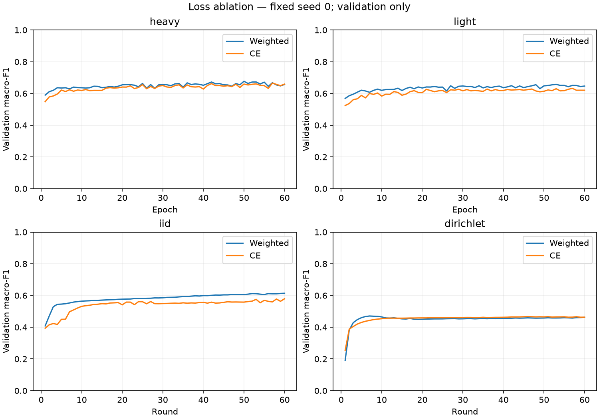

# Loss-function comparison — 2026-10-05

Validation only, model/partition seed 0, 60 epochs or rounds, no early stopping. Both losses select their first best validation macro-F1 checkpoint. CE means unweighted cross-entropy; weighted means square-root class-weighted CE.

| Lane | Weighted F1 (step) | CE F1 (step) | Gain (pp) | Gate A / B |
|---|---:|---:|---:|---|
| heavy | 0.6769 (50) | 0.6656 (57) | -1.14 | False / False |
| light | 0.6576 (53) | 0.6324 (57) | -2.53 | False / False |
| iid | 0.6140 (60) | 0.5793 (60) | -3.47 | False / False |
| dirichlet | 0.4706 (7) | 0.4669 (46) | -0.37 | False / False |

Gates are project preferences, not statistical significance or deployment tests. A: gain ≥1 pp macro-F1, false-alert increase ≤2 pp, every class recall drop ≤2 pp. B: false-alert reduction ≥5 pp, macro-F1 drop ≤1 pp, Web/Brute Force recall drops ≤2 pp.

## Selected-checkpoint recall and false alerts

| Lane / loss | False alerts | Benign | DDoS | DoS | Recon | Web-based | Brute Force | Spoofing | Mirai |
|---|---:|---:|---:|---:|---:|---:|---:|---:|---:|
| heavy / weighted | 20.35% | 79.65% | 80.37% | 81.43% | 74.26% | 33.44% | 25.27% | 80.94% | 99.54% |
| heavy / CE | 24.45% | 75.55% | 80.24% | 83.32% | 85.92% | 10.83% | 16.97% | 77.52% | 99.48% |
| light / weighted | 22.66% | 77.34% | 80.57% | 77.16% | 77.23% | 30.41% | 16.61% | 75.83% | 99.43% |
| light / CE | 29.27% | 70.73% | 83.70% | 73.77% | 84.31% | 2.71% | 14.80% | 77.87% | 99.38% |
| iid / weighted | 31.50% | 68.50% | 71.14% | 83.06% | 80.35% | 11.62% | 14.80% | 69.34% | 99.34% |
| iid / CE | 45.17% | 54.83% | 86.97% | 54.59% | 82.66% | 0.00% | 14.80% | 73.93% | 99.38% |
| dirichlet / weighted | 12.74% | 87.26% | 99.93% | 0.13% | 34.83% | 0.00% | 14.80% | 39.24% | 98.18% |
| dirichlet / CE | 9.23% | 90.77% | 99.97% | 0.88% | 37.11% | 0.00% | 0.00% | 53.41% | 98.28% |

Full precision, recall, F1, confusion matrices, deltas and provenance are in [summary.json](summary.json).

## Measured local training cost

| Lane / loss | Train + validation seconds | Examples processed | Optimizer steps |
|---|---:|---:|---:|
| heavy / convergence | 417.3 | 26,435,640 | 51,660 |
| heavy / loss | 344.0 | 26,435,640 | 51,660 |
| light / convergence | 198.8 | 26,435,640 | 51,660 |
| light / loss | 179.0 | 26,435,640 | 51,660 |
| iid / convergence | 259.4 | 26,435,640 | 52,800 |
| iid / loss | 173.4 | 26,435,640 | 52,800 |
| dirichlet / convergence | 216.9 | 26,435,640 | 52,200 |
| dirichlet / loss | 174.4 | 26,435,640 | 52,200 |

Timing excludes setup/checkpoint IO and is measured on this CPU host, not edge hardware. Epochs and FL rounds are not compute-equivalent.

## Verification and limitations

- Verified complete 60-step histories, best-checkpoint selection and checkpoint/scaler/partition hashes.
- Paired settings differ only in loss; source, data, packages, features, model configuration, scaler and partitions match.
- Single-seed validation selection is exploratory. No significance claim, no test access, no cloud use.
- Eight of twelve screening runs completed; four remain. No multi-seed confirmations yet.
- All source comments and prior outputs are preserved; no model/training code changes were needed.

