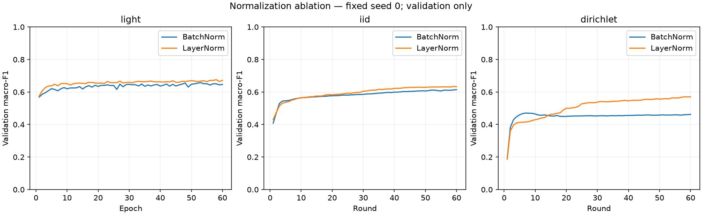

# Normalization comparison — 2026-10-05

Validation only; model/partition seed 0; 60 epochs or rounds; weighted CE; no early stopping. Select first-best validation macro-F1 within each run.

| Lane | BatchNorm F1 (step) | LayerNorm F1 (step) | Gain (pp) | Gate A / B |
|---|---:|---:|---:|---|
| light | 0.6576 (53) | 0.6761 (58) | +1.85 | False / False |
| iid | 0.6140 (60) | 0.6339 (59) | +1.99 | False / True |
| dirichlet | 0.4706 (7) | 0.5705 (58) | +9.98 | False / True |

Gates are project preferences, not significance tests. A: macro-F1 gain ≥1 pp, false-alert increase ≤2 pp, each class recall drop ≤2 pp. B: false-alert reduction ≥5 pp, macro-F1 drop ≤1 pp, Web/Brute Force recall drops ≤2 pp.

## Selected-checkpoint recall and false alerts

| Lane / norm | False alerts | Benign | DDoS | DoS | Recon | Web-based | Brute Force | Spoofing | Mirai |
|---|---:|---:|---:|---:|---:|---:|---:|---:|---:|
| light / BN | 22.66% | 77.34% | 80.57% | 77.16% | 77.23% | 30.41% | 16.61% | 75.83% | 99.43% |
| light / LN | 19.52% | 80.48% | 92.85% | 69.23% | 75.52% | 30.89% | 19.49% | 75.69% | 99.40% |
| iid / BN | 31.50% | 68.50% | 71.14% | 83.06% | 80.35% | 11.62% | 14.80% | 69.34% | 99.34% |
| iid / LN | 23.88% | 76.12% | 80.28% | 75.86% | 78.80% | 12.26% | 14.80% | 68.87% | 99.24% |
| dirichlet / BN | 12.74% | 87.26% | 99.93% | 0.13% | 34.83% | 0.00% | 14.80% | 39.24% | 98.18% |
| dirichlet / LN | 4.78% | 95.22% | 97.20% | 22.51% | 53.71% | 4.30% | 14.80% | 49.06% | 99.21% |

## Central-light minus federated macro-F1 gap

| Norm | IID gap | Non-IID gap |
|---|---:|---:|
| BN | 4.36 pp | 18.70 pp |
| LN | 4.22 pp | 10.56 pp |

## Measured local compute

| Lane / norm | Training + validation seconds | Examples processed | Optimizer steps | Parameters |
|---|---:|---:|---:|---:|
| light / BN | 198.8 | 26,435,640 | 51,660 | 5,544 |
| light / LN | 143.7 | 26,435,640 | 51,660 | 5,544 |
| iid / BN | 259.4 | 26,435,640 | 52,800 | 5,544 |
| iid / LN | 144.1 | 26,435,640 | 52,800 | 5,544 |
| dirichlet / BN | 216.9 | 26,435,640 | 52,200 | 5,544 |
| dirichlet / LN | 144.4 | 26,435,640 | 52,200 | 5,544 |

Host timing excludes setup/checkpoint IO. Controls were measured separately under uncontrolled host load; these are not causal speed comparisons or edge measurements.

## Verification

- Complete histories, selected metrics and checkpoint/scaler/partition hashes verified.
- Paired source, data, package versions, features, class counts, scaler and partitions match; only normalization differs in settings/model configuration.
- No test evaluation. Single-seed validation selection is exploratory, not significance evidence.
- Eleven of twelve screening runs complete; no confirmation runs in this stage.

Full class precision/recall/F1, confusion matrices and manifests: [summary.json](summary.json).

