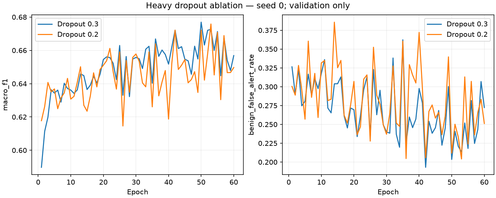

# Completed validation screening — 2026-10-05

Twelve planned runs, seed 0, fixed partition seed 0, 60 epochs/rounds. Each score selects the first-best validation macro-F1 checkpoint; no test evaluation.

| Run | Best step | Macro-F1 | False alerts | Web recall | Brute Force recall | Gate A / B vs control |
|---|---:|---:|---:|---:|---:|---|
| convergence/heavy | 50 | 0.6769 | 20.35% | 33.44% | 25.27% | Control |
| convergence/light | 53 | 0.6576 | 22.66% | 30.41% | 16.61% | Control |
| convergence/iid | 60 | 0.6140 | 31.50% | 11.62% | 14.80% | Control |
| convergence/dirichlet | 7 | 0.4706 | 12.74% | 0.00% | 14.80% | Control |
| loss/heavy | 57 | 0.6656 | 24.45% | 10.83% | 16.97% | False / False |
| loss/light | 57 | 0.6324 | 29.27% | 2.71% | 14.80% | False / False |
| loss/iid | 60 | 0.5793 | 45.17% | 0.00% | 14.80% | False / False |
| loss/dirichlet | 46 | 0.4669 | 9.23% | 0.00% | 0.00% | False / False |
| normalization/light | 58 | 0.6761 | 19.52% | 30.89% | 19.49% | False / False |
| normalization/iid | 59 | 0.6339 | 23.88% | 12.26% | 14.80% | False / True |
| normalization/dirichlet | 58 | 0.5705 | 4.78% | 4.30% | 14.80% | False / True |
| heavy_dropout/heavy | 53 | 0.6758 | 20.41% | 42.68% | 36.46% | False / False |

Gate A requires ≥1 pp macro-F1 gain, ≤2 pp false-alert increase and ≤2 pp recall loss for every class. Gate B requires ≥5 pp false-alert reduction, ≤1 pp macro-F1 loss and ≤2 pp Web/Brute Force recall loss. These are project preferences, not significance or deployment tests.

## Final dropout ablation: every class recall

| Class | Dropout 0.3 | Dropout 0.2 | Change (pp) |
|---|---:|---:|---:|
| Benign | 79.65% | 79.59% | -0.06 |
| DDoS | 80.37% | 78.40% | -1.97 |
| DoS | 81.43% | 84.80% | +3.37 |
| Recon | 74.26% | 79.11% | +4.85 |
| Web-based | 33.44% | 42.68% | +9.24 |
| Brute Force | 25.27% | 36.46% | +11.19 |
| Spoofing | 80.94% | 75.51% | -5.43 |
| Mirai | 99.54% | 99.53% | -0.01 |

Full per-class precision/recall/F1, confusion matrices, provenance and compute for every run are in [summary.json](summary.json).

## Checks and limits

- Verified every run against the frozen plan, full history, best-step selection, checkpoint/scaler/partition hashes and shared source/data/package provenance.
- Each ablation differs only in its declared settings/model-configuration override from its same-lane control.
- Single-seed validation selection is exploratory. Reusing seed 0 in later summaries does not make it independent confirmation.
- CPU timing includes training/validation but excludes setup/checkpoint IO; host load differs between runs. It is not an edge measurement or causal speed comparison.

